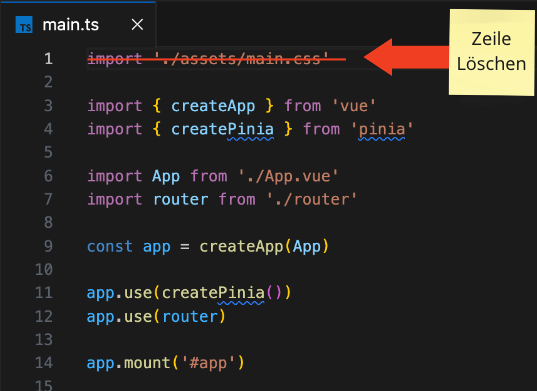
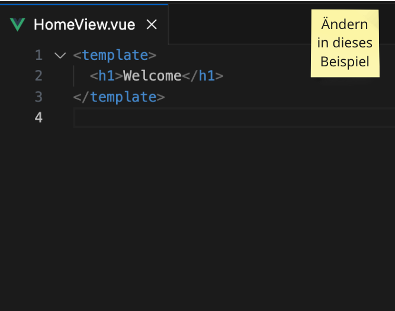
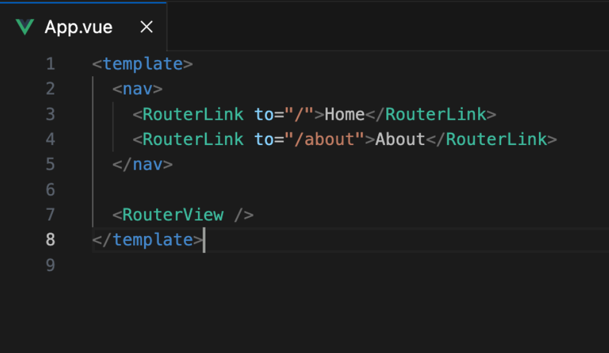

# Task 01: Installation eines VueJs Projektes mit create-vue

In diesem Task geht es darum, dass du dein VueJS Projekt für den Workshop aufsetzt.

## Installations Tasks

- [ ] Starte die Installlation in der deiner bash mit `npm init vue@latest`
- [ ] Wähle folgende konfiguration aus
  - [ ] Project name: bookmanager oder was immer dir gefällt
  - [ ] Add TypeScript? `YES`
  - [ ] Add JSX Support? `NO`
  - [ ] Add Vue Router? `YES`
  - [ ] Add Vue Pinia? `YES`
  - [ ] Add Vitest? `NO`
  - [ ] Add End-to-End Testing? `NO`
  - [ ] Add ESLINT? `YES`
  - [ ] Add Prettier? `YES`
- [ ] Folge den Anweisung nach der Erstellung des Projektes.
- [ ] Öffne das Projekt in einem Editor deiner Wahl

## Tasks zum Zurücksetzen der Beispiel-Dateien und löschen der Dummy Dateien

create vue erzeugt immer eine kleine Demo. Diese wollen wir aber nicht. Daher müssen wir ein paar Datein anpassen und löschen.

- [ ] Öffne die Datei `src/main.ts` und lösche die erste Zeile `import '.assets/main.css'`
  - 
- [ ] Öffne die Datei `src/views/HomeView.vue` und ändere sie wie im nachfolgendem Bild zu sehen.
  - 
- [ ] Öffne die Datei `src/views/App.vue` und ändere sie so wie im nachfolgendem Bild zu sehen.
  - 
- [ ] Lösche die folgeden Dateien
  - [ ] `src/assets/*` - Alle Dateien im Ordner
  - [ ] `src/stores/counter.ts`
  - [ ] `src/components/*` - Alle Ordner und Dateien im Ordner.
