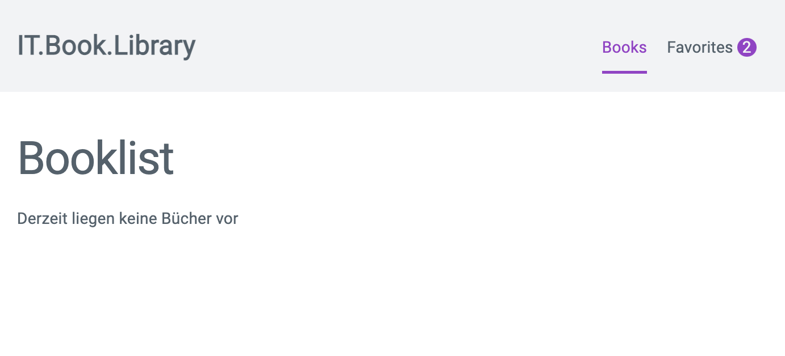

# Task 02: Basis Layout aufbauen

In diesem Task wirst du das Basis Layout Aufbauen. Im Ordner `resources`stehen dir einzelne Bauteile zu Verfügung die du einbauen sollst um das Basis Layout einzurichten.

## Sub Task: CSS einbinden

- Binde die folgenden drei CSS Dateien in genau dieser Reihenfolge, global in dein VueJS Projekt ein
  - `normalize.css` - [Source Code anzeigen](https://raw.githubusercontent.com/may17/bookmanager-example/tasks/task-02-basis-layout-einrichten/resources/normalize.css)
  - `milligram.css` - [Source Code anzeigen](https://raw.githubusercontent.com/may17/bookmanager-example/tasks/task-02-basis-layout-einrichten/resources/milligram.css)
  - `main.css` - [Source Code anzeigen](https://raw.githubusercontent.com/may17/bookmanager-example/tasks/task-02-basis-layout-einrichten/resources/main.css)
  - INFO: Milligram ist das CSS Framework welches wir verwenden im WorksTraining.

## Sub Task: Header Komponente erstellen

- Erstelle in deinem Projekt Verzeichnis `src/components` eine neue Komponente `LayoutHeader.vue`
  - Füge den Inhalt aus [dieser Datei](https://raw.githubusercontent.com/may17/bookmanager-example/tasks/task-02-basis-layout-einrichten/resources/LayoutHeaderTemplate.html) in den Template Block deiner `LayoutHeader.vue` Komponente.
- Falls noch vorhanden entferne den `nav` Block mit den beiden RouterLinks.
- Registriere die Komponente in der `App.vue` und sorge dafür das sie vor der `RouterView` Component angezeigt wird.

## Sub Task: Main Content Area

- Umgib die `RouterVue` Komponente mit einem Main html tag und einer Klasse Container
  - ```html
    <main class="container">
      <RouterView />
    </main>
    ```
- Öffne in deinem Projekt die Datei `src/views/HomeView.vue` und füge im Template Block den Html Code aus [dieser Datei](https://raw.githubusercontent.com/may17/bookmanager-example/tasks/task-02-basis-layout-einrichten/resources/HomeViewTepmlate.html)

## Task complete

Schreibe in den Zoom Chat `task-02 done` wenn du alle Tasks abgeschlossen hast und due folgende Ansicht im Browser siehst:


