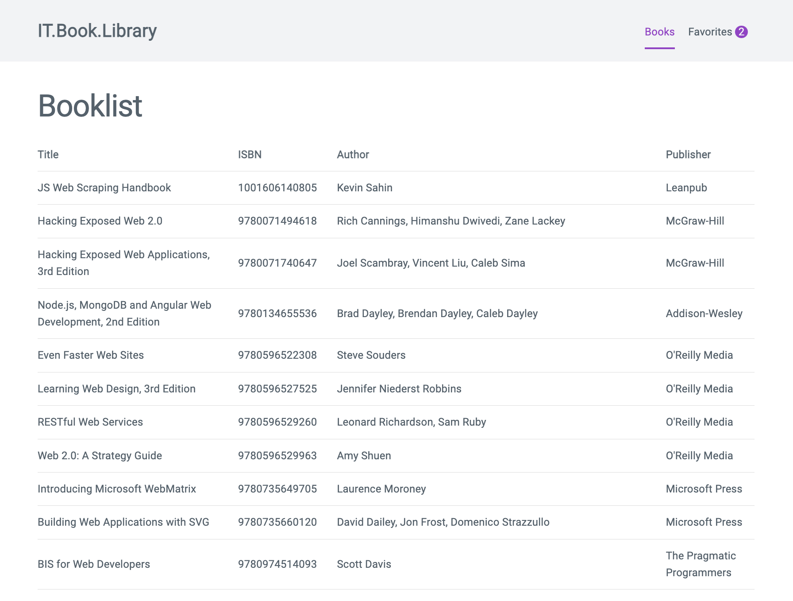

# Task 03: Book Listing mit Api Anbindung

In diesem Task wirst du über die die Trainings Rest-API (Bookmonkey Api) Bücher ziehen und in deiner VueJS Applikation rendern.

## Sub Task: Api starten

- Führe in deiner Kommandozeile den Befehl `npx bookmonkey-api` aus. Die Api sollte dir mitteilen das sie unter dem Port `4730` bereit steht.
- Rufe anschließend im Browser die Url [http://localhost:4730](http://localhost:4730/). Du solltest dort die Dokumentation zur API wiederfinden.

## Sub Task: API Daten in Vue Applikation rendern

- Erstelle eine neue Komponente `BookList.vue` im Ordner `src/components` und sorge dafür das diese in der View `src/views/HomeView.vue` ausgegeben wird.
  - Verwende [dieses Template](https://raw.githubusercontent.com/may17/bookmanager-example/tasks/task-03-book-listing/resources/BooklistTableTemplate.html) zum Auflisten der Bücher in einer Tabelle.
- Überlege welche data properties du benötigst und füge sie der Komponente hinzu
- Lege im Ordner `src` mit eine `types.ts` Datei an.
  - Füge der Datei [dieses Book interface](https://raw.githubusercontent.com/may17/bookmanager-example/tasks/task-03-book-listing/resources/types.ts) hinzu
- Erstelle mit TypeScript ein Interface für die Data Properties der Komponente `BookList.vue`. Verwende dazu das Book Interface aus der types.ts
- Nutze den `created hook` um mit der fetch Api die Buchdaten zu laden und in der Tabelle zu rendern.
- Beachte die TypeScript Hinweise und lass den npm task `npm run type-check` durchlaufen.

## Task complete

Schreibe in den Zoom Chat `task-03 done` wenn du alle Tasks abgeschlossen hast und du folgende Ansicht im Browser siehst:

