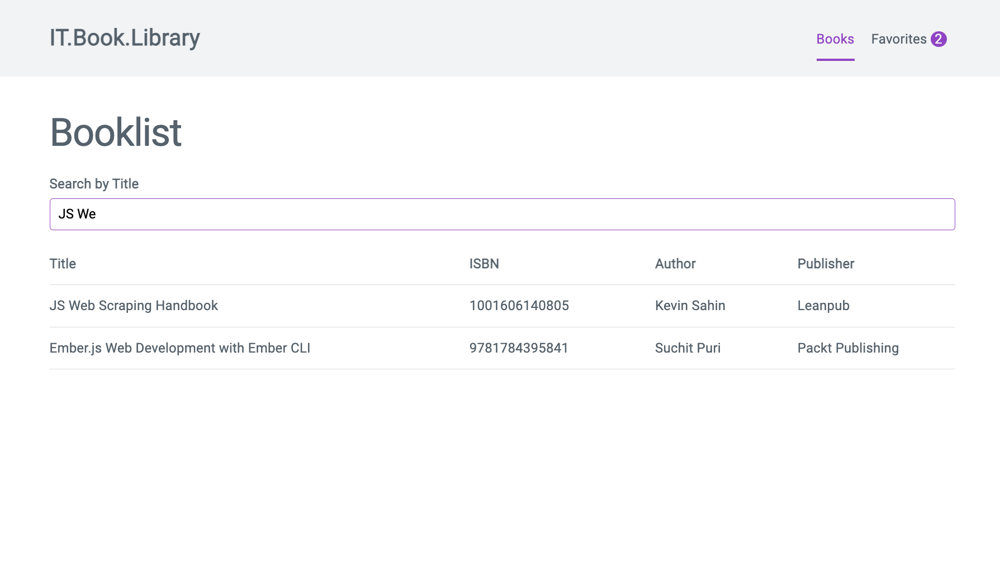
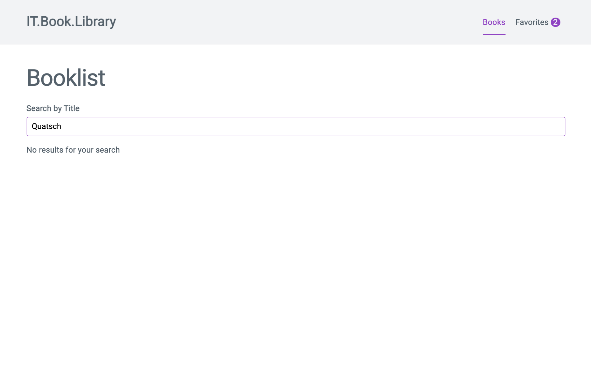

# Task 04: Einbindung Suchfeld

In diesem Task wirst du überhalb der Bücherliste eine Suchfunktion einbauen um die Bücher in Echtzeit durchsuchen zu können.

## Todos

- Binde überhalb der Büchertabelle [dieses HTMl Formular](https://raw.githubusercontent.com/may17/bookmanager-example/tasks/task-04-suchfeld/resources/SearchFormTemplate.html) ein.
- Implementiere eine Volltextsuche auf den `Titel des Buches` für die Bücherliste
  - Verwende `v-model`
  - Verwende ein `computed property` zum aktualisieren der Liste
    - Tipp 1: [MDN Docs String includes](https://developer.mozilla.org/en-US/docs/Web/JavaScript/Reference/Global_Objects/String/includes)
    - Tipp 2: [MDN Docs Array filter](https://developer.mozilla.org/en-US/docs/Web/JavaScript/Reference/Global_Objects/Array/filter)
- Wenn das computed property keine Ergebnisse beinhaltet sollte die Tabelle ausgeblendet werden und stattdessen ein Text angezeigt werden `Sorry, deine Suche hat keine Treffer ergeben.`

## Task complete

Schreibe in den Zoom Chat `task-04 done` wenn du alle Tasks abgeschlossen hast und du folgende Ansicht im Browser siehst:

