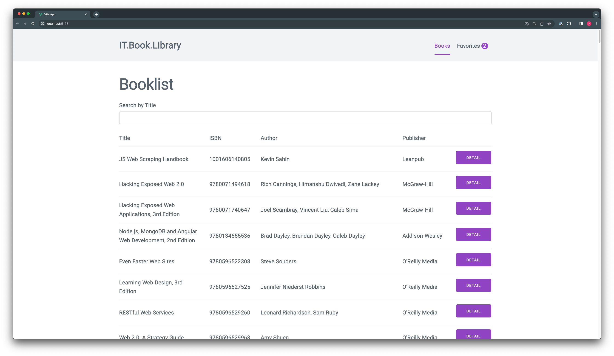
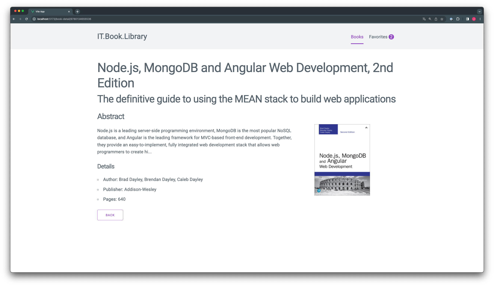

# Task 05: Detailseite

In diesem Task wirst du eine Detailseite einbinden damit man sich pro Buch alle vorhandenen Details anzeigen lassen kann.

## Subtask: Detailseite anlegen und Route registrieren

- Erstelle eine neue View Komponente `BookDetailView.vue` im Ordner `src/views`.
- Kopiere in den Template Bereich der `BookDetailView.vue` Komponente [dieses HTML Template](https://raw.githubusercontent.com/may17/bookmanager-example/tasks/task-05-detail-seite/resources/BookDetailTemplate.html).
- Öffne die Datei `src/router.ts` und erstelle für die `BookDetailView.vue` eine neue Route `/book-detail`.
  - Vergiss das `name` property nicht.
- Kontrolliere deine Arbeit indem du im Browser die route `/book-detail` in deinem Webbrowser aufrufst. Du solltest dann eine Detailseite sehen.

## Subtask: Daten für Detailseite von Api laden

- Füge in der `router.ts` neuen `/book-detail` route einen parameter `id` hinzu.
- Öffne die `BookDetailView.vue` und lade mit Hilfe des Parameters `id` die Details eines Buches und render diese.
  - Vergiss nicht TypeScript zu verwenden. Das `Book` interface steht unter `@/types` bereit.
  - Zum testen: Gib einen id parameter in die URL z.B. `http:localhost:3000/book-detail/1001606140805`
  - Verwende die fetch api.
  - Speichere die Daten der Api in einem data property z.B. book.
  - Über `http://localhost:4730/books/<ID>` erhälst du die Details zu einem Buch von der API. Z.B.
    http://localhost:4730/books/1001606140805
  - Über `this.$route.params` kannst du die Parameter aus der Url auslesen.
  - Beim Bild hilft dir das attribute Binding mit `v-bind:src`

## Subtask: Detail Button einbauen

- Öffne die Komponente `src/components/BookList.vue` und füge in der Tabelle eine neue Spalte hinzu
  - Im Head und Body der Tabelle
- Verwende die Globale `RouterLink` Komponente um in der neuen Spalte im `tbody` eine Verlinkung zur Detailseite hinzuzufügen
  - Verwende das `name` property der route
- Gib dem `RouterLink` ein `class` html attribute mit dem CSS Class Wert `button` für das Styling

## Subtask: Back Button einbauen

- Öffne die Komponente `src/views/BookDetailView.vue` und Tausche das `a html tag` für den Back Button gegen eine `RouterLink` Komponente und verlinke auf die Bücher Auflisten Seite
- Für das Styling füge die css Klassen `button button-outline` hinzu.

## Task complete

Schreibe in den Zoom Chat `task-05 done` wenn du alle Tasks abgeschlossen hast und zwischen Detailseiten und Auflistung navigieren kannst.

